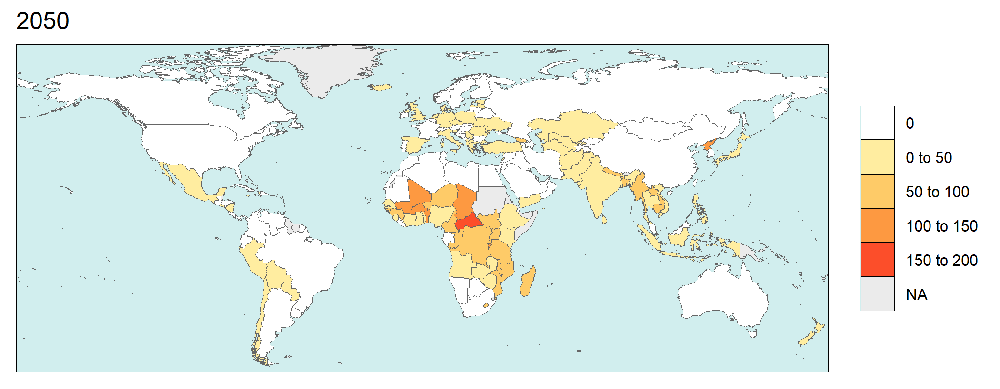

# Summary
Recent evidence highlights household air pollution as a significant health risk, particularly in the global South. 
However, its impacts are frequently overlooked in the integrated assessment models widely used for global scenario analyses.
Alternative scenarios with diverse socioeconomic pathways or climate policies could reshape access to affordable clean energy, particularly for low-income groups, directly impacting household air pollution.

`rhap` is an R package developed to estimate health impacts attributable to household air pollution (HAP) under alternative scenarios simulated using the Global Change Analysis Model (GCAM). 
These impacts are derived using an econometric model that links health outcomes from HAP to various air pollutant emissions and socioeconomic variables, all of which can be extracted from scenario-specific GCAM outputs. 
Figure 1 provides an overview of the `rhap` package structure.


The `rhap` package is publicly available on GitHub at https://github.com/bc3LC/rhap. Below is a simplified example demonstrating how to run the package. 
Comprehensive documentation is also provided and can be accessed [here](https://bc3lc.github.io/rhap/index.html).

```r
install.packages("devtools")
library(devtools)
devtools::install_github("bc3LC/rhap")
library(rhap)

db_path <- "path_to_your_gcam_database" # NULL if project file provided
db_name <- "name of the database" # NULL if project file provided
prj_name <- "name of the project file"
scen_name <- "name of the GCAM scenario" # or vector of names

 
hap_damages <- calc_hap_impacts (db_path = NULL,  db_name = NULL, 
                                 prj_name,
				 query_path = "./inst/extdata", queries = "queries_rhap.xml",
               			 scen_name, final_db_year = 2100,
				 HIA_var = "deaths",
                                 saveOutput = T, map = F, anim = T,
                                 normalized = F, by_gr = F) 


```


# Statement of need

Recent data indicates that 2.1 billion people worldwide lack access to clean, modern cooking fuels and technologies [@tracking_2024]. 
As a result, they rely on open fires or inefficient stoves fueled by kerosene, traditional biomass (such as fuelwood or animal dung), and coal. 
These conventional energy sources release a range of harmful pollutants, including fine particulate matter (PM2.5), nitrogen oxides (NOx), and volatile organic compounds (VOCs). 
These direct emissions, coupled with factors such as household size, ventilation, and building materials [@balakrishnan2013state], are the primary contributors to the formation of household air pollution (HAP).

According to the World Health Organization’s (WHO) [Global Health Observatory]( https://www.who.int/data/gho/data/indicators/indicator-details/GHO/household-air-pollution-attributable-deaths), 
HAP is one of the major risk factors for human health, particularly in the global South, causing around 3.2 million deaths per year in 2020, including over 237,000 deaths of children under the age of 5. 
HAP affects human health from pre-conception to old age, leading to noncommunicable diseases including cataract, chronic obstructive pulmonary disease, ischaemic heart disease, lower respiratory infections, lung cancer, neonatal disorders, stroke, and type 2 diabetes [@bennitt2021estimating]. 
In addition to its direct health impacts, which disproportionately affect infants and the elderly, household air pollution (HAP) also has broader socioeconomic consequences.
For instance, recent studies demonstrate that exposure to high pollution levels can significantly reduce work productivity [@neidell2023air]. 
Likewise, women bear the greatest health burden from polluting fuels, as they often handle household chores, further exacerbating gender inequalities [@krishnapriya2021improved]. 

Given the magnitude of these effects, various methodologies have been developed to estimate HAP and its associated health implications.
A recent study employed Bayesian hierarchical models to estimate annual average personal exposure and indoor concentration levels [@mohajeri2023urban]. 
Similarly, the BAR-HAP tool, developed by the WHO, provides a framework to quantify the benefits of reducing HAP and compare them against the costs of intervention [@das2021benefits]. 
However, HAP and its subsequent impacts on human health are usually ignored in global scenario analysis. 
Alternative socioeconomic and climate scenarios, such as high or low GDP growth pathways and the adoption of deep decarbonization strategies, will significantly influence the transition to cleaner energy fuels and technologies.
These pathways can enhance access to less harmful energy sources for lower-income households, thereby reducing exposure to household air pollution (HAP) and mitigating its adverse impacts on human health.
The incorporation of these dynamics into integrated assessment models, such as the Global Change Analysis Model (GCAM), offers valuable insights for evaluating alternative future scenarios.

GCAM is a multisector integrated assessment model that quantifies human and Earth-system dynamics by examining the interconnections between the economy, energy, water, climate, and agriculture, forestry, and land use (AFOLU) systems. 
It enables exploration of “what-if” scenarios within a unified platform. Detailed documentation is available [online](https://github.com/JGCRI/gcam-doc). 
Focusing on emissions, GCAM estimates a wide range of greenhouse gases and air pollutants for each future scenario, categorized by sector, region, and time period up to 2100. 
Nevertheless, while GCAM estimates direct air pollutant emissions from the residential sector, it does not account for household air pollution (HAP) levels or their associated health impacts. 
The `rhap` package bridges this gap by quantifying HAP impacts for each GCAM scenario. 
Using an econometric model detailed in the provided [documentation]( https://bc3lc.github.io/rhap/articles/fit_model.html), `rhap` extracts emissions and other relevant data, such as region- and period-specific floorspace and per capita GDP, from a given GCAM output database. 
It then produces detailed tables, figures, and maps illustrating HAP impacts by country and time period for the entire world. 
Given the well-documented importance of HAP and its health impacts, a tool that automatically estimates these effects within the GCAM modelling framework represents a valuable advancement for the integrated assessment modelling (IAM) community, 
and it addresses a critical gap in global scenario analysis.


# Functionality
The core function of this package is the `calc_hap_impacts` function, specifically designed to estimate health impacts attributable to household air pollution (HAP) across different GCAM scenarios. 
This function extracts and processes the required socioeconomic and emissions data from GCAM databases or project files and employs a fixed-effects econometric regression model to estimate impacts. 
Key covariates in the model include direct emissions from the residential sector (Primary PM2.5, NOx, and VOC), per capita GDP, and per capita floorspace.
The model is calibrated using cross-regional, multi-year panel data aggregated from diverse sources. 
Detailed information about the model’s formulation, underlying assumptions, and data sources is provided in the accompanying [vignette](https://bc3lc.github.io/rhap/articles/fit_model.html). 

The `calc_hap_impacts` function offers flexibility in generating three distinct health impact metrics: premature mortalities, Years of Life Lost (YLLs), and Disability-Adjusted Life Years (DALYs). 
Users can specify the desired metric by setting the HIA_var parameter, with premature mortalities selected by default. 
Additionally, the package includes an optional feature to estimate health impacts by income decile within each region, activated by setting `by_gr = TRUE`. 
While country-level calculations are recommended for consistency, this feature provides valuable insights into the distribution of health impacts across population groups, helping users explore intra-regional disparities. 
For further customization, users can adjust the `normalized` parameter to produce results either as absolute values or normalized metrics (e.g., per 100,000 inhabitants), catering to different analytical needs. 
In terms of outputs, activating the saveOutput parameter enables the function to save results as a Comma-Separated Values (CSV) file in the `output` sub-directory. 
The function can also generate damage maps and animations by enabling the `map` and `anim` parameters, respectively. These visualizations, created using the rmap package [@khan2022rmap], are extensively documented on the [rmap website]( https://jgcri.github.io/rmap/). 
Figure 2 illustrates a representative example of the outputs generated by the `calc_hap_impacts` function.



The package includes an additional function, `calc_ResidEm_grp`, which quantifies the contribution of within-region consumer groups (e.g., income deciles) to emissions of various pollutants driving household air pollution (HAP). 
Results are categorized by GCAM region, year, and pollutant. Users can customize the analysis by specifying the desired region, time period, and pollutant through adjustable parameters. 
The 32 GCAM regions are outlined in the [GCAM documentation]( https://github.com/JGCRI/gcam-doc), and results are also available for the EU-27 and Global categories. 
Time periods span from 2020 to 2100, in 10-year intervals. A full list of pollutants that can be analyzed is provided in the dedicated [vignette](https://bc3lc.github.io/rhap/articles/ResidEm_grp.html). 
This functionality supports targeted assessments of how different consumer groups contribute to HAP emissions within specific contexts, offering valuable insights for research and policy development. 
Figure 3 showcases a representative example of the outputs generated by the `calc_ResidEm_grp` function.

{width="42.5%"}

# Acknowledgements
This research is supported by the European Union’s Horizon research program under grant agreement 101060679 (GRAPHICS project); 
by the María de Maeztu Excellence Unit 2023-2027 Ref. CEX2021-001201-M, funded by MCIN/AEI /10.13039/501100011033; 
and by the Basque Government through the BERC 2022-2025 program. The authors also acknowledge financial support from the Horizon Europe European Commission Projects ‘IAM COMPACT’ (grant no. 101056306) and ‘DIAMOND’ (grant no. 101081179). 
The views and opinions expressed in this paper are those of the authors alone.

# References
